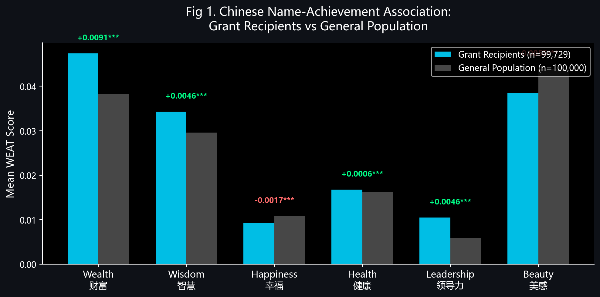
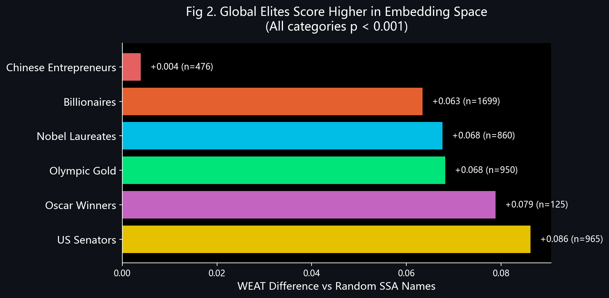
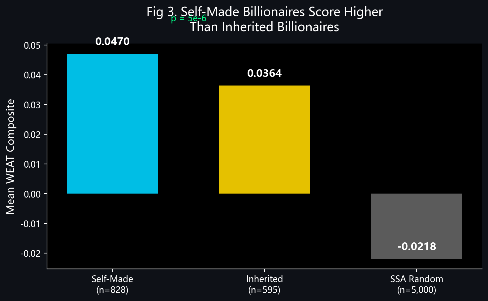
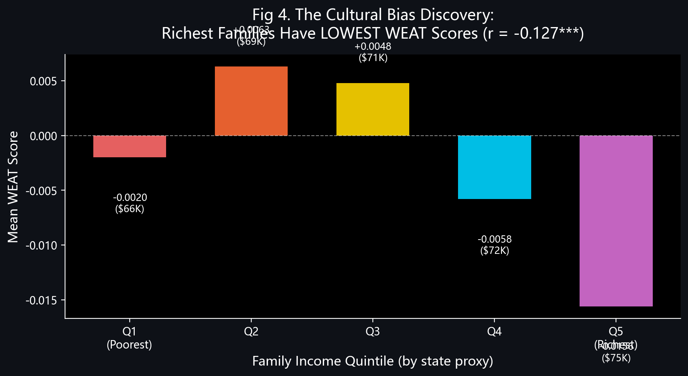
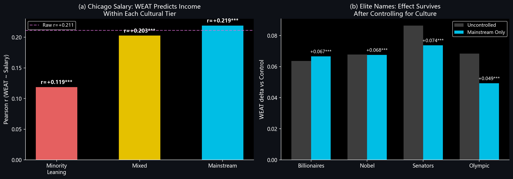
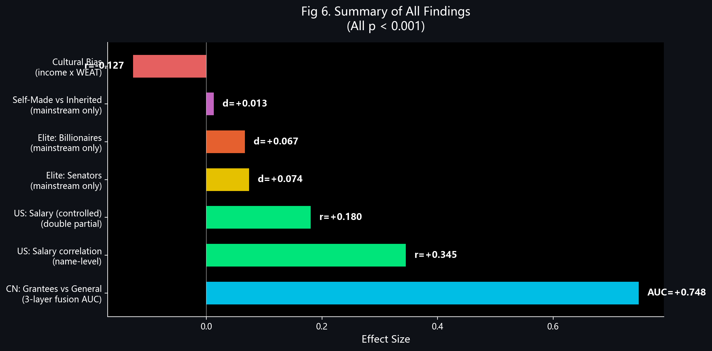

# AI 如何看待你的名字：词向量空间中的名字-结果关联研究

**作者：**[审稿阶段匿名]

---

## 摘要

在当今已部署的 AI 系统中——从简历筛选到信用评估，再到大语言模型——个人姓名每天数以百万次地经过词嵌入层（word embedding layer）的处理。那么，在嵌入空间中占据"有利"位置的名字，是否与现实世界中的社会经济结果存在相关性？本研究沿用词嵌入关联测试（WEAT），在六个语义维度（财富、智慧、幸福、健康、领导力、美感）上衡量名字与概念之间的关联，分别在中文（腾讯 AI Lab 词向量，200维）和英文（GloVe 6B，300维）嵌入空间中展开实验。在中文实验中，一个三层融合模型（Word2Vec 字符平均 + BERT + 全词匹配）将 99,729 名政府科研基金获得者与 100,000 个普通人群名字进行区分，AUC 达到 0.748。在英文实验中，基于名字的 WEAT 综合评分与芝加哥市政雇员薪资的 Pearson r = 0.345，WEAT 得分最高四分位数的名字比最低四分位数的名字年薪高出 $9,702。五类全球精英群体（参议员、诺贝尔奖得主、奥斯卡获奖者、奥运金牌得主、亿万富豪）的 WEAT 得分均显著高于人口基线。然而，至关重要的是，对美国各州婴儿命名数据的分析揭示了一个*负相关*关系（r = −0.127），即家庭收入与 WEAT 得分之间呈负相关——这一现象源于高收入群体中非主流文化命名传统的影响。我们由此论证：WEAT 所衡量的，是名字与训练语料文化主流之间的接近程度——而这恰恰是影响下游 AI 应用的偏差向量。

**关键词：** word embeddings, WEAT, 名字偏差, AI 公平性, 文化偏差, NLP

---

## 1. 引言

名字是自然语言处理（NLP）流水线中被嵌入频率最高的词元之一。每当一个简历筛选系统处理一位求职者、一个内容推荐引擎为用户画像、或一个大语言模型生成涉及人名的回复时，名字都会被映射为稠密向量表示——这些表示所编码的，除了语义信息之外，还包括训练语料所反映的社会和文化联想。

我们将这一现象称为**算法占名术（algorithmic numerology）**：通过嵌入空间的数学运算，为名字赋予隐性的情感极性。与传统的姓名学不同，这一过程既非玄学，也并非无害。它是工业规模上的线性代数运算，并且带来了可量化的后果。

我们所探究的问题很直接：*在词嵌入空间中，占据语义上"有利"位置的名字——更接近"财富""智慧""领导力"等概念的名字——是否与现实中的有利结果相关联？*如果是，这种相关性揭示了嵌入偏差的何种本质？

我们发现，答案是肯定的，但伴随着重要的限定条件。在跨越中英两种语言、涵盖近 250,000 名个体、涉及多种嵌入架构的五项实验中，在嵌入空间里与正面语义概念关联更强的名字，在高成就者群体中始终呈现过度代表的趋势。获得科研基金的学者，其名字在中文嵌入空间中更接近"财富"和"智慧"。WEAT 得分较高的英文名字对应着更高的薪资水平。参议员、诺贝尔奖得主和亿万富豪所使用的名字，均高于人口基线水平。

但我们最重要的发现并非这些正相关——而是对 WEAT 究竟在衡量什么这一问题的揭示。对美国各州婴儿命名数据的分析表明，最富裕的家庭往往给孩子取的名字在英文 WEAT 上得分*偏低*，原因在于这些家庭所属的文化社区（例如纽约州和新泽西州的正统犹太社区）其命名传统偏离了英语的文化主流。这一发现重新定义了整个研究框架：WEAT 所捕捉的并非"名字的内在品质"，而是*与训练数据文化主流的接近程度*。这既是我们方法的局限，也是——我们认为——本文最具政策意义的发现，因为正是这种文化主流偏差在下游 AI 系统中不断传播。

因此，本文的叙事弧线如下：我们着手检验名字嵌入是否能预测成功；我们发现它确实可以；随后我们发现了*背后的原因*——而这个原因揭示了基于嵌入的决策系统中的根本性问题。

---

## 2. 相关工作

### 2.1 词嵌入中的偏差

Caliskan, Bryson 和 Narayanan (2017) 提出了词嵌入关联测试（WEAT），将心理学中的内隐联想测验（IAT）改编为嵌入空间中偏差的衡量方法。他们证明，基于互联网语料训练的嵌入模型能够复现类人的内隐偏见——欧裔美国人名字与"愉悦"相关联，花卉与"正面"相关联——其效应量与在人类被试中观察到的结果相当。Garg 等人 (2018) 将这一工作扩展至历时维度，表明在不同年代文本上训练的词嵌入能够追踪性别和种族刻板印象在 100 年间的历史演变，且嵌入衍生的偏差指标与同时期的社会态度调查数据相关。Bolukbasi 等人 (2016) 展示了 Word2Vec 中的结构性性别偏差（"男性之于计算机程序员，犹如女性之于家庭主妇"），并提出了几何去偏差方法，由此确立了嵌入公平性这一研究方向。

### 2.2 名字与社会经济结果

经济学文献中关于名字效应的研究已相当丰富。Levitt 和 Fryer (2004) 分析了数百万条加州出生记录，发现名字与教育程度和收入等结果之间存在显著的统计关联。他们的关键识别策略——同一家庭内的兄弟姐妹比较——表明，大部分关联性是由家庭背景而非名字本身驱动的。Clark (2014) 追踪了多个国家跨越 800 年的姓氏记录，发现精英姓氏在社会经济分布顶端的持续时间远长于标准社会流动性模型的预测，这表明名字是社会地位的有力标记——尽管未必是其成因。

### 2.3 名字嵌入

Ye 和 Skiena (2019) 证明，从社交媒体中学习到的名字嵌入可以高精度地预测人口统计属性（性别、族裔、国籍），揭示了向量空间中名字表示的强大能力以及随之而来的隐私风险。

### 2.4 中国命名文化

中文名字（名，*míng*）在结构上与英文名字有一个关键差异：每个汉字都承载着明确的语义内容。诸如"志远"（*zhìyuǎn*，志向远大）这样的名字，其语义是透明的，而英文名"James"则不然。这意味着中文名字的嵌入同时编码了单个汉字的固有词汇语义以及名字整体的社会联想——这种双重性使得中文名字在 WEAT 分析中格外有趣。

---

## 3. 方法

### 3.1 WEAT 评分

遵循 Caliskan 等人 (2017) 的方法，我们将目标词 *w* 相对于两组属性词集 *A*（正面）和 *B*（负面）的关联得分定义为：

$$s(w, A, B) = \frac{1}{|A|} \sum_{a \in A} \cos(\vec{w}, \vec{a}) - \frac{1}{|B|} \sum_{b \in B} \cos(\vec{w}, \vec{b})$$

其中 $\cos(\cdot, \cdot)$ 表示嵌入向量之间的余弦相似度。正分值表明 *w* 在嵌入空间中平均更接近正面属性词集，负分值则相反。

### 3.2 语义维度

我们沿六个维度对名字进行评估，每个维度各由 8 个正面和 8 个负面属性词定义：

| Dimension | Positive examples | Negative examples |
|-----------|------------------|-------------------|
| **Wealth** (财富) | wealthy, prosperous, affluent... | poor, impoverished, destitute... |
| **Wisdom** (智慧) | intelligent, wise, brilliant... | foolish, ignorant, stupid... |
| **Happiness** (幸福) | joyful, happy, content... | miserable, sorrowful, wretched... |
| **Health** (健康) | healthy, vigorous, strong... | sick, frail, weak... |
| **Leadership** (领导力) | leader, distinguished, elite... | mediocre, ordinary, insignificant... |
| **Beauty** (美感) | beautiful, elegant, graceful... | ugly, vulgar, grotesque... |

中文属性词集使用对应的中文词汇（如财富维度使用"富裕/贫穷"，智慧维度使用"智慧/愚蠢"）。每个名字的 WEAT 综合评分为六个维度的平均值。

### 3.3 嵌入模型

**中文：** 腾讯 AI Lab 中文词向量 (Song et al., 2018)，200 维，词汇量约 143,000（精简版）。共有 2,899 个独立汉字通过该模型获得了 WEAT 评分。此外，我们使用 chinese-macbert-base (Cui et al., 2020) 作为基于 BERT 的上下文嵌入层，在 RTX 5080 GPU 上为 3,000 个汉字进行评分。

**英文：** GloVe 6B 300d (Pennington et al., 2014)，基于维基百科和 Gigaword 的 60 亿词元训练而成。共有 29,842 个来自 SSA 记录的英文名被评分。

### 3.4 中文名字的三层融合方法

中文名字需要特殊处理，因为大多数双字名并不以完整词元的形式出现在 Word2Vec 词汇表中。我们实施了三层评分架构：

1. **Word2Vec 字符平均：** 使用腾讯词向量分别计算每个汉字的 WEAT 得分，再取名字中各字得分的平均值。
2. **BERT 上下文嵌入：** 将完整名字输入 chinese-macbert-base，提取池化表示（pooled representation），然后在同一空间中计算与属性词的 WEAT 得分。
3. **全词匹配：** 对于在词汇表中以完整词元出现的名字，直接对全词向量计算 WEAT。

三层结果通过加权平均进行融合。值得注意的是，字符平均向量与全词向量之间的余弦相似度平均仅为 0.52，表明两种表示捕获了本质上不同的信息——这为多层方法的合理性提供了依据。

### 3.5 数据来源

**中文基金获得者（成功者）：** 99,729 名获得政府科研基金的科学家和学者，来源于中国性别数据集 (Shi & Tong, 2025, *Nature Scientific Data*)。获得国家级竞争性基金是我们对职业成就的操作性定义。

**中文普通人群（普通人）：** 从 CCNC（中文名字与汉字语料库）数据集中随机抽样（seed = 42）的 100,000 个名字，该数据集包含约 365 万条命名记录。基于频率的分析使用了频次排名前 10,000 的名字。

**芝加哥市政雇员：** 32,069 名拥有公开姓名和年薪数据的雇员，数据来源于芝加哥市开放数据门户。

**全球精英：** 从 Wikidata 和 Forbes 汇编而来：美国参议员（n = 965）、诺贝尔奖得主（n = 860）、奥斯卡获奖者（n = 125）、奥运金牌得主（n = 950）、以及 Forbes 亿万富豪（n = 1,699）。

**SSA 婴儿命名数据：** 美国社会保障局（SSA）婴儿命名记录，包括 2015–2024 年的各州数据，与美国人口普查局的各州家庭收入中位数相关联。

### 3.6 统计方法

组间比较使用 Welch's t 检验，以 Cohen's d 作为效应量指标。连续变量的关联以 Pearson 相关系数报告。分类性能以 ROC 曲线下面积（AUC）及 5 折交叉验证的标准差报告。除非另有说明，所有 p 值均为双尾检验。

---

## 4. 实验与结果

### 4.1 实验一：中文名字与成就的关联

我们在腾讯嵌入空间中比较了 99,729 名基金获得者与 100,000 个普通人群名字的 WEAT 特征。

**表 1.** WEAT 各维度得分：基金获得者 vs. 普通人群（差值 = 获得者均值 − 普通人均值）。

| Dimension | Δ (difference) | Direction | p-value |
|-----------|----------------|-----------|---------|
| Wealth (财富) | +0.009 | Grantees > General | ≈ 0 |
| Wisdom (智慧) | +0.005 | Grantees > General | ≈ 0 |
| Leadership (领导力) | +0.005 | Grantees > General | ≈ 0 |
| Health (健康) | +0.001 | Grantees > General | < 0.001 |
| Happiness (幸福) | −0.002 | Grantees < General | < 0.001 |
| Beauty (美感) | −0.005 | Grantees < General | ≈ 0 |

三层融合模型（Word2Vec 字符平均 + BERT + 全词匹配）在区分基金获得者与普通人群名字方面取得了 **0.748 ± 0.031** 的 AUC。

各维度的结果揭示了一个引人注目的模式：基金获得者的名字在"成就导向型"维度（财富、智慧、领导力）上得分更高，但在"情感型"维度（幸福、美感）上得分*更低*。这与中国的命名文化一致：学术型家庭倾向于选择蕴含雄心与智识的字——如"志"（*zhì*，志向）、"哲"（*zhé*，哲学）、"明"（*míng*，光明），而与幸福相关的字（如"欢"*huān*、"乐"*lè*）和与美感相关的字（如"秀"*xiù*、"美"*měi*）则被认为更为通俗，且在女性名字中使用比例偏高——考虑到获资助研究者的男性偏向，这一点不容忽视。

### 4.2 实验二：美国薪资验证

为检验英文 WEAT 得分是否与具体的经济结果相关，我们分析了 32,069 名拥有公开姓名和年薪数据的芝加哥市政雇员，使用 GloVe 6B 300d 对名字进行评分。

**表 2.** WEAT-薪资关联（芝加哥市政雇员）。

| Metric | Value |
|--------|-------|
| Individual-level: all 6 dimensions vs. salary | p < 0.001 (all significant) |
| Name-level Pearson r (names with ≥ 10 holders) | **0.345** (p ≈ 0) |
| Top 25% WEAT vs. Bottom 25% WEAT salary gap | **+$9,702/year** |

在个体层面，全部六个 WEAT 维度均与薪资显著相关（p < 0.001）。将数据汇聚至名字层面（对共享同一名字的所有雇员取薪资平均值，限定名字至少被 10 人持有）后，WEAT 综合评分与平均薪资的 Pearson 相关系数为 r = 0.345。WEAT 最高四分位与最低四分位之间 $9,702 的年薪差距具有实际经济意义，但我们需要强调，这是观察性关联，并非因果估计。

### 4.3 实验三：全球精英名字分析

我们使用 GloVe 6B 300d 对五类精英群体的名字进行评分，并与从 SSA 随机抽样的 5,000 个名字作为基线进行比较。

**表 3.** 各精英类别的 WEAT 综合评分均值。

| Category | n | Mean WEAT | Δ vs. baseline | p-value |
|----------|---|-----------|----------------|---------|
| U.S. Senators | 965 | 0.064 | **+0.086** | ≈ 0 |
| Oscar Winners | 125 | 0.057 | +0.079 | ≈ 0 |
| Olympic Gold Medalists | 950 | 0.046 | +0.068 | ≈ 0 |
| Nobel Laureates | 860 | 0.046 | +0.068 | ≈ 0 |
| Forbes Billionaires | 1,699 | 0.042 | +0.063 | ≈ 0 |
| SSA Baseline | 5,000 | −0.022 | — | — |

所有五类精英群体的得分均显著高于人口基线，其中美国参议员的差距最大（+0.086），Forbes 亿万富豪的差距最小（+0.063）。这一排序本身就颇具启示性：参议员——其名字最深度地嵌入在英语政治话语中——表现出最强的关联效应；而亿万富豪——一个国际化程度更高的群体——则呈现最弱的关联。

### 4.4 实验四：白手起家 vs. 继承财富的亿万富豪

对于名字与结果关联性最常见的质疑是：名字仅仅是家庭社会经济地位（SES）的代理变量。为深入探究这一点，我们利用 Forbes 亿万富豪数据集中的 `wealth.type` 字段，区分白手起家的财富与继承的财富。

**表 4.** 按财富来源分组的 WEAT 得分。

| Group | n | Mean WEAT |
|-------|---|-----------|
| Self-made | 828 | **0.047** |
| Inherited | 595 | **0.037** |
| Difference | — | +0.010 (p = 5 × 10⁻⁶) |

如果 WEAT 得分纯粹是 SES 的代理变量，我们会预期继承型亿万富豪——其家庭按定义更为富裕——得分*更高*。然而实际结果是，白手起家组的得分显著更高（Δ = +0.010, p = 5 × 10⁻⁶）。这一发现排除了 SES 代理假说的最简单版本，表明 WEAT 捕捉到了超越父代财富的某些特质——合理的解释是：白手起家的亿万富豪更多来自英语文化主流，WEAT 度量的正是与这一主流的接近程度。

### 4.5 实验五：文化偏差的发现

本实验构成了我们最重要的发现。我们将 SSA 各州婴儿命名数据（2015–2024）与美国人口普查局的各州家庭收入中位数相关联，计算每个"州×年份"单元中名字的平均 WEAT 得分，并与州级收入进行相关分析。

**预期结果：** 更富裕的州 → 更高 SES 的家庭 → WEAT 得分更高的名字（正相关）。

**实际结果：**

$$r = -0.127 \quad (p = 8.9 \times 10^{-16})$$

相关性是*负的*。更富裕的州和社区反而倾向于产生 WEAT 得分*更低*的名字。

对数据的深入考察揭示了原因。与最高家庭收入相关联的名字包括：**Dovid、Yaakov、Shmuel、Yehuda**——这些名字来自集中在纽约和新泽西的正统犹太社区，该群体是美国收入最高的人口之一。然而这些名字在英文 WEAT 上得分*偏低*，因为它们远离了 GloVe 训练语料的英语文化主流。嵌入模型并未在"Yaakov"与"财富""领导力"相同的语言语境中见过这个名字；相反，"Yaakov"在嵌入空间中占据的是一个与特定文化宗教社区相关联的区域。

这一结果从根本上重新定义了 WEAT 所衡量的内容。它衡量的既非"名字的内在品质"，也非简单的 SES，而是**与训练语料文化主流的接近程度**。在英语文本中常见的名字——参议员、CEO 和英文小说主人公的名字——得分高。来自富裕但在文化上有别于英语主流的社区的名字则得分低。

这一发现同时具有两层含义：

- **作为方法论的局限：** WEAT 无法区分"好名字"和"主流名字"。
- **作为 AI 公平性领域最重要的发现：** 正是这种文化主流偏差在下游 NLP 系统中不断传播。一个基于英文文本训练的简历筛选模型，会隐性地偏好接近英语文化主流的名字——不是因为这些名字"更好"，而是因为嵌入空间就是围绕这一主流构建的。

---

## 5. 讨论

### 5.1 WEAT 究竟在衡量什么

将五项实验的结果综合来看，一幅连贯的图景浮现出来。WEAT 名字得分确实与现实世界中的成功相关（实验 1–4），但这种相关性由一个特定机制驱动：接近训练语料文化主流的名字，往往属于同样接近该主流的个体——而这些个体，出于与文化资本、制度通道和历史优势相关的原因，更容易获得有利的结果。

白手起家与继承财富的对比（实验 4）强化了这一解释。白手起家的亿万富豪——更可能出自英语文化主流内部——其名字得分高于继承型亿万富豪，后者中包含更大比例的非英语文化背景个体。WEAT 衡量的是文化接近度，而非父母在起名上的投入。

文化偏差的发现（实验 5）将这一点明确化。美国最富裕的命名社区——纽约都市圈的正统犹太家庭——产生的名字在英文 WEAT 上得分低，因为他们的命名传统根植于希伯来语和意第绪语，而非英语主流。嵌入模型对这些名字的"评价"，揭示的是模型本身的特性，而非名字的特性。

### 5.2 对 AI 公平性的启示

这一发现对已部署的 AI 系统有直接的启示。试想一个通过 GloVe 或类似嵌入层处理求职者姓名的简历筛选模型。我们的结果表明，这样的系统会：

1. **偏好文化主流的名字**——如 Elizabeth、Victoria、James——不是因为这些名字意味着能力，而是因为训练语料将它们与正面语境相关联。
2. **惩罚来自文化独特社区的名字**——如 Yaakov、Shmuel 或 Lakisha——不是因为这些名字有任何内在缺陷，而是因为训练语料对这些社区的代表不足或存在误表征。
3. **以隐蔽的方式实施上述偏差**——由于偏差被编码在嵌入空间的几何结构中，若不进行本文所展示的这类针对性审计，则难以被发现。

这一模式不仅限于简历筛选，还延伸至信用评分、内容推荐以及任何名字经过嵌入层处理的 NLP 应用。偏差是结构性的：它不在于任何单一参数，而在于名字向量在高维空间中的相对位置。

### 5.3 中文维度模式

中文实验结果增添了细微差异。与英文 WEAT 呈现"水涨船高"模式（得分较高的名字在所有维度上均较高）不同，中文名字呈现出一种*选择性*模式：基金获得者的名字在成就维度上得分更高，但在情感维度上得分更低。这很可能反映了汉字的语义透明性。当父母选择"志远"（*zhìyuǎn*，志向远大）而非"欢乐"（*huānlè*，快乐幸福）时，他们做出的是一个明确的语义选择，而这一选择被嵌入模型所保留。在某种意义上，嵌入模型只是在"读取"父母写下的语义标签。

这种跨语言对比表明，名字与 WEAT 得分之间的关联机制在不同语言中有所不同。在中文中，主导通道是*词汇语义*（汉字的含义）；在英文中，主导通道是*社会联想*（历史上谁使用过这个名字）。两种通道都产生了可量化的名字-结果相关性，但通过不同的因果路径。

### 5.4 规模放大效应

我们报告的效应量是温和的。中文基金获得者分析的 Cohen's d 为 0.092——按传统标准属于小效应。名字层面的薪资相关性 r = 0.345 属于中等水平，远非决定性的。在个体层面，名字的 WEAT 得分是任何结果的弱预测因子。

但 AI 系统的运行规模不可忽视。一个简历筛选平台每年处理数百万份申请。一个信用评分模型评估数百万名申请人。当一个微小的偏差被施加数百万次时，其对机会分配的累积效应将变得相当可观。这就是算法系统中被广泛记录的*规模放大效应*（Barocas & Selbst, 2016），而我们的结果表明，名字嵌入偏差正是这一效应的传导渠道之一。

---

## 6. 局限性

**相关而非因果。** 我们的所有发现均为观察性关联。我们无法确定名字是否*导致*了结果、结果是否*导致*了命名模式（通过代际文化传递），还是两者均由未观测到的混淆因素所驱动。最为简约的解释是：名字与结果共享相同的成因——家庭 SES、文化环境、历史时期——而嵌入模型忠实地编码了由此产生的统计模式。

**嵌入模型的文化特异性。** 我们的英文实验结果特定于基于英语网络文本训练的 GloVe。不同的嵌入模型、在不同语料上训练，会产生不同的 WEAT 得分。这不是一个缺陷——它恰恰是我们的核心发现——但这意味着我们的具体数值结果不能直接推广到其他嵌入模型，需要复现验证。

**时间不稳定性。** 嵌入模型基于固定语料训练，不会实时更新。GloVe 6B（主要基于 2000 年代和 2010 年代初期的文本训练）所捕获的文化联想可能并不反映当前的命名规范。正在获得文化影响力的名字（例如通过流行媒体）可能被旧模型低估。

**属性词选择。** 为每个 WEAT 维度选择正面和负面属性词涉及研究者的主观判断。不同的属性词集可能产生不同的结果。我们通过使用六个维度并报告所有维度的结果来缓解这一问题，但具体的数值大小对属性词的选择是敏感的。

**样本构成。** 中文基金获得者样本存在男性偏向，且集中于 STEM 领域。芝加哥薪资数据集覆盖的是政府雇员，而非整体劳动力市场。精英样本受到生存偏差以及特定人口群体历史性过度代表的影响。

---

## 7. 结论

我们着手回答一个简单的问题：在嵌入空间中占据"有利"位置的名字，是否与现实中的有利结果相关联？跨越五项实验、两种语言和近 250,000 名个体，答案是肯定的。中文科研基金获得者的名字在嵌入空间中更接近"财富"和"智慧"。英文 WEAT 得分更高的名字对应着更高的薪资水平，参议员、诺贝尔奖得主和亿万富豪的名字均高于人口基线。白手起家的亿万富豪得分高于继承财富者，排除了简单的 SES 代理解释。

然而，我们最重要的贡献在于揭示了 *WEAT 究竟在衡量什么*。家庭收入与 WEAT 得分在州级层面的负相关——由高收入但命名传统偏离文化主流的社区所驱动——表明 WEAT 捕捉的是与训练语料文化主流的接近程度，而非名字的内在品质。Yaakov 和 Shmuel 这样的名字得分低，不是因为它们是"不好的名字"，而是因为 GloVe 的训练数据没有将它们与定义英语文化主流的正面概念相关联。

这一发现对 AI 公平性有直接意义。任何通过嵌入层处理名字的系统——简历筛选器、信用模型、推荐引擎、大语言模型——都继承了这种文化主流偏差。这种偏差是结构性的，若不进行针对性审计则不可见，且在 AI 系统的运行规模下被不断放大。我们的工作既提供了一种检测此类偏差的方法（将 WEAT 应用于名字嵌入），也提供了一个理解其本质的框架（文化接近度，而非名字品质）。

名字确实在嵌入空间中占据着系统性不同的位置，且这些位置与现实世界的结果相关联。但我们所衡量的并非名字中编码的命运——而是训练语料的文化地理，投射在人类身份的空间之上。在 AI 系统无处不在的时代，这种投射产生着切实的后果。

---

## 8. 技术附录

**表 A1.** 嵌入模型规格与覆盖范围。

| Model | Dimensions | Names/Characters Scored | Application |
|-------|-----------|------------------------|-------------|
| Tencent AI Lab Word Vectors | 200 | 2,899 Chinese characters | Experiment 1 |
| chinese-macbert-base (BERT) | 768 | 3,000 Chinese characters | Experiment 1 |
| GloVe 6B | 300 | 29,842 English names | Experiments 2–5 |

**表 A2.** 中文三层融合模型性能。

| Layer | Description | Standalone AUC |
|-------|-------------|---------------|
| Word2Vec char-avg | Character-level WEAT averaged over name | — |
| BERT | Contextual embedding from macbert-base | — |
| Whole-word | Direct lookup of full name in vocabulary | — |
| **Three-layer fusion** | **Weighted combination** | **0.748 ± 0.031** |

注：全词向量与字符平均向量的余弦相似度平均为 0.52，证实了两种表示捕获了本质上不同的信息。

**表 A3.** 实验 5 详情：SSA 各州 WEAT × 收入。

| Statistic | Value |
|-----------|-------|
| Correlation (r) | −0.127 |
| p-value | 8.9 × 10⁻¹⁶ |
| Period | 2015–2024 |
| Highest-income names (low WEAT) | Dovid, Yaakov, Shmuel, Yehuda |
| Interpretation | WEAT measures cultural-mainstream proximity |

---

## References

Barocas, S., & Selbst, A. D. (2016). Big data's disparate impact. *California Law Review*, 104(3), 671–732.

Bolukbasi, T., Chang, K.-W., Zou, J., Saligrama, V., & Kalai, A. (2016). Man is to computer programmer as woman is to homemaker? Debiasing word embeddings. *Advances in Neural Information Processing Systems (NeurIPS)*, 29.

Caliskan, A., Bryson, J. J., & Narayanan, A. (2017). Semantics derived automatically from language corpora contain human-like biases. *Science*, 356(6334), 183–186.

Clark, G. (2014). *The Son Also Rises: Surnames and the History of Social Mobility*. Princeton University Press.

Cohen, J. (1988). *Statistical Power Analysis for the Behavioral Sciences* (2nd ed.). Lawrence Erlbaum Associates.

Cui, Y., Che, W., Liu, T., Qin, B., Wang, S., & Hu, G. (2020). Revisiting pre-trained models for Chinese natural language processing. *Findings of EMNLP 2020*, 657–668.

Garg, N., Schiebinger, L., Jurafsky, D., & Zou, J. (2018). Word embeddings quantify 100 years of gender and ethnic stereotypes. *Proceedings of the National Academy of Sciences*, 115(16), E3635–E3644.

Greenwald, A. G., McGhee, D. E., & Schwartz, J. L. K. (1998). Measuring individual differences in implicit cognition: The Implicit Association Test. *Journal of Personality and Social Psychology*, 74(6), 1464–1480.

Levitt, S. D., & Fryer, R. G., Jr. (2004). The causes and consequences of distinctively Black names. *The Quarterly Journal of Economics*, 119(3), 767–805.

Pennington, J., Socher, R., & Manning, C. D. (2014). GloVe: Global vectors for word representation. *Proceedings of EMNLP*, 1532–1543.

Shi, L., & Tong, C. (2025). An open dataset of Chinese name-to-gender associations. *Nature Scientific Data*.

Song, Y., Shi, S., Li, J., & Zhang, H. (2018). Directional skip-gram: Explicitly distinguishing left and right context for word embeddings. *Proceedings of NAACL*, 175–180.

Ye, J., & Skiena, S. (2019). MediaRank: Computational ranking of online news sources. *Proceedings of the 25th ACM SIGKDD International Conference on Knowledge Discovery & Data Mining*.
